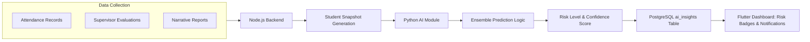
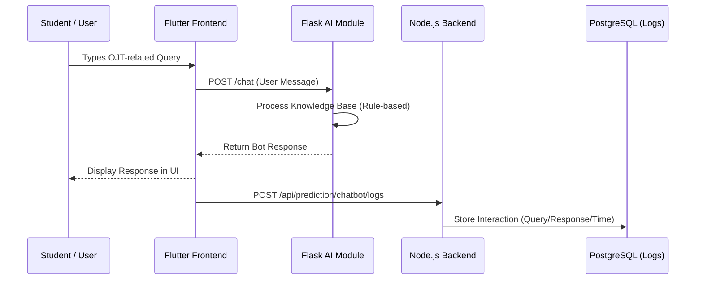
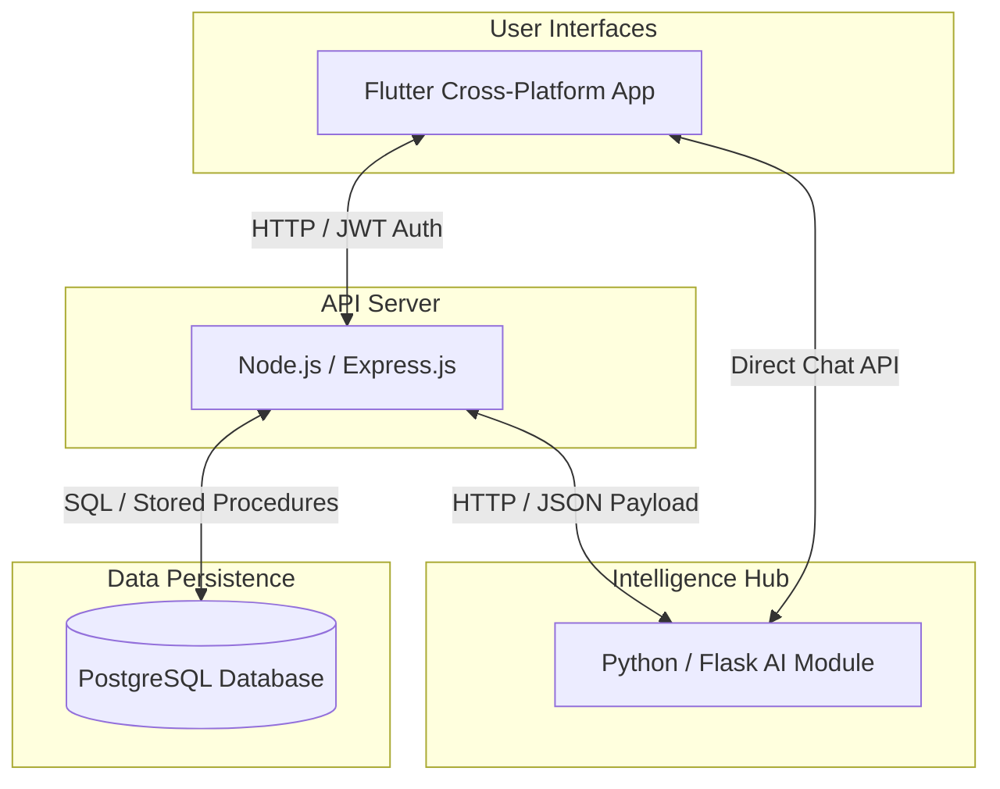
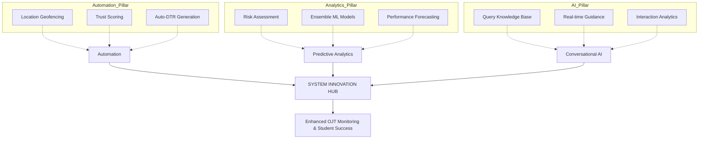
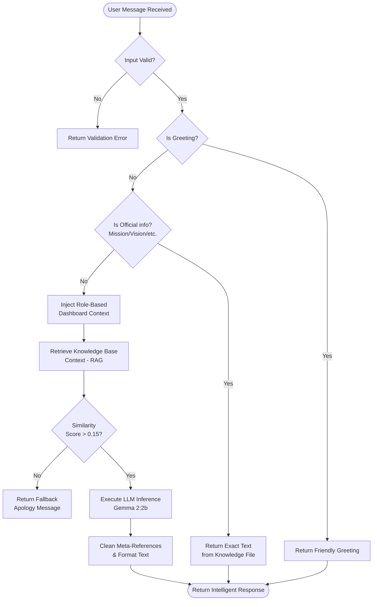

# Chapter 4: System Innovation and Contribution - Diagrams

This document contains the conceptual and technical diagrams for the OJT AI System as part of Chapter 4 of the project documentation.

## A. Predictive Analytics Algorithm
The system utilizes an **Ensemble Machine Learning** approach, combining three distinct algorithms to ensure high accuracy and robust risk prediction for student performance.

```mermaid
graph TD
    Data[Student Snapshot Data] --> Pre[Pre-processing & Scaling]
    Pre --> Model1[Logistic Regression Model (40% Weight)]
    Pre --> Model2[Random Forest Model (40% Weight)]
    Pre --> Model3[Naive Bayes Model (20% Weight)]
    
    Model1 --> Prob1[Class Probabilities]
    Model2 --> Prob2[Class Probabilities]
    Model3 --> Prob3[Class Probabilities]
    
    Prob1 --> Ensemble[Weighted Averaging Ensemble Hub]
    Prob2 --> Ensemble
    Prob3 --> Ensemble
    
    Ensemble --> Final[Final Risk Level Prediction: HIGH / MEDIUM / LOW]
```

---

## B. AI Prediction and Insight Generation
This diagram illustrates the flow from raw data collection to the generation of actionable insights and performance badges.



---

## C. Conversational AI (Chatbot Support)
The interaction flow for the AI chatbot, demonstrating both automated response generation and secure interaction logging.



---

## D. System Integration Architecture
A high-level view of the four core pillars of the system and how they communicate.



---

## E. System Innovation Framework
The conceptual innovation of the system, where three independent technologies are integrated to create a smarter OJT management environment.



---

## F. Chatbot Decision Logic Flow (Verified)
This flowchart represents the **actual implementation** of the AI's internal decision-making process in the `chatbot_handler.py` and `run_ai.py` modules.


