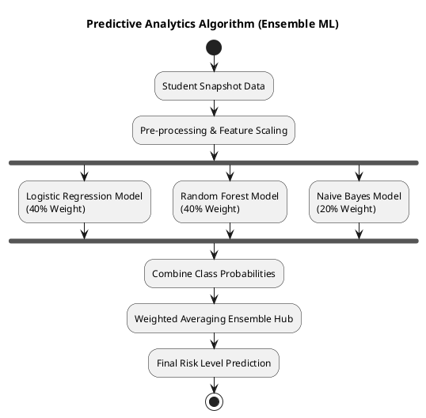
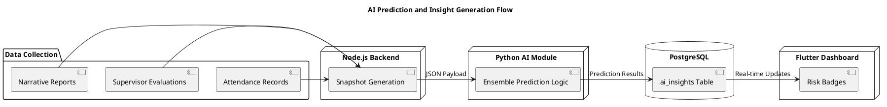
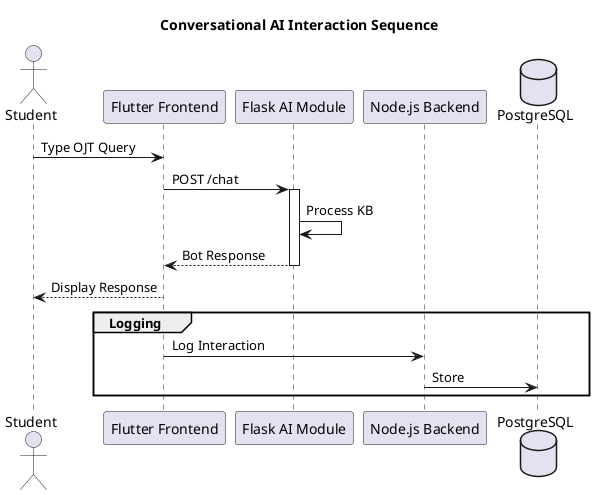
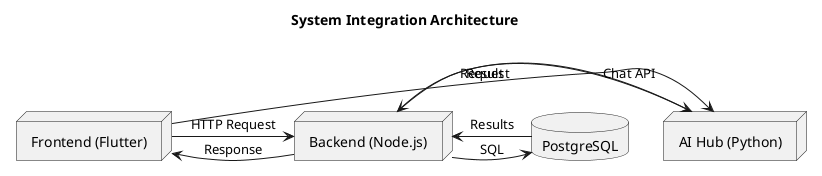
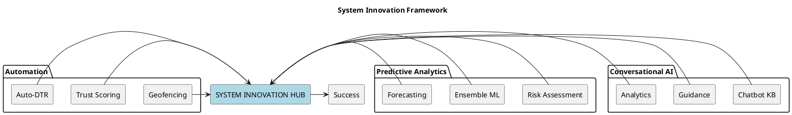
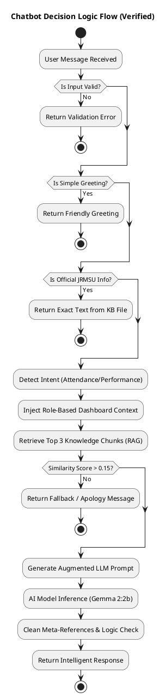

# Chapter 4: PlantUML Diagrams (Fixed)

You can copy and paste the following blocks into any PlantUML editor (like [PlantText](https://www.planttext.com/) or [PlantUML Online](https://www.plantuml.com/plantuml/)).

## A. Predictive Analytics Algorithm

---

## B. AI Prediction and Insight Generation

---

## C. Conversational AI (Chatbot Support)

---

## D. System Integration Architecture

---

## E. System Innovation Framework

---

## F. Chatbot Decision Logic Flow (Verified)

